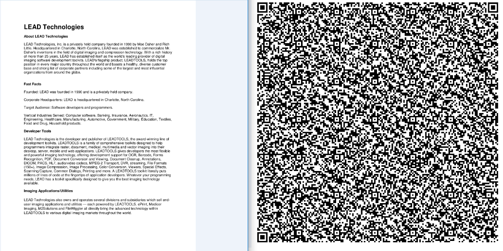

# LTOcrQr
.NET Core Console Application using LEADTOOLS Nuget packages that OCR's the input image and converts the characters/strings to QR Code data

The following project utilizes the LEADTOOLS OCR and Barcode libraries to enable users to OCR a given input image and output the recognized text, encoded into QR Code data. More information an be found at the links below:

Leadtools OCR SDK:
https://www.leadtools.com/sdk/ocr

Leadtools QR Code SDK:
https://www.leadtools.com/sdk/barcode/2d-qr-code

#Note: must have LEADTOOLS libraries to run

